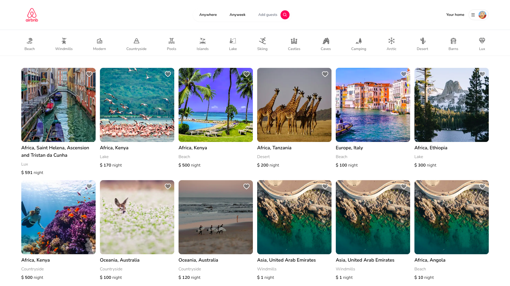
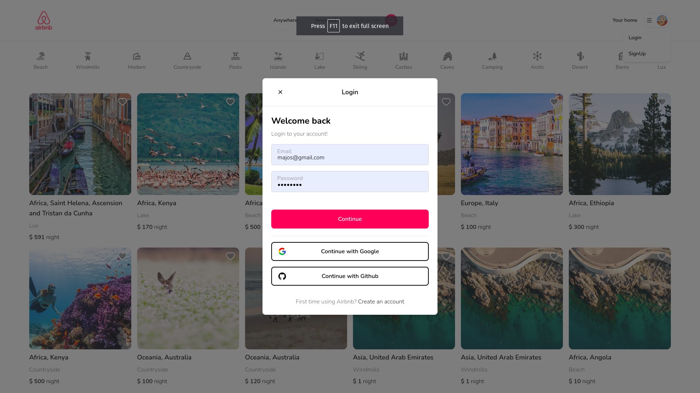
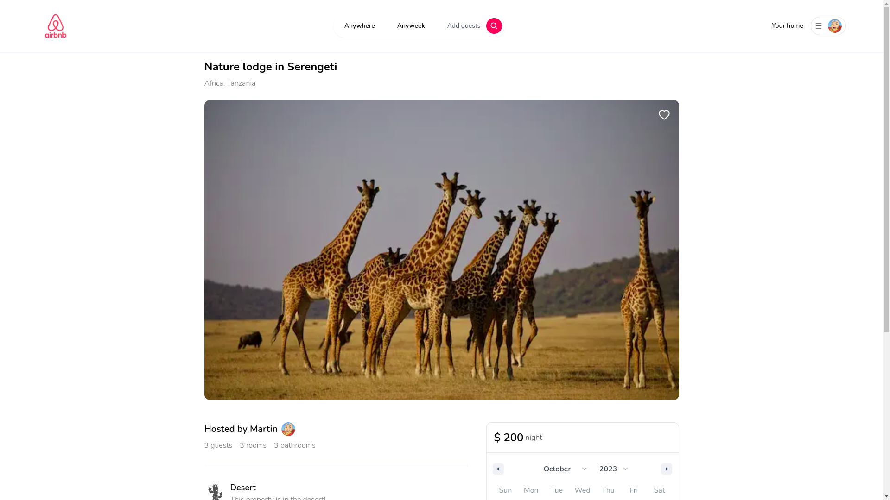

This is a [Next.js](https://nextjs.org/) project bootstrapped with [`create-next-app`](https://github.com/vercel/next.js/tree/canary/packages/create-next-app).

# Airbnb Clone with MongoDB and Next.js

This is a clone of Airbnb built using MongoDB and Next.js. It allows you to explore and book accommodations in various locations.





## Getting Started

To run this project on your local machine, follow these steps:

1. Clone this repository to your local machine:

   ```bash
   git clone https://github.com/your-username/airbnb-clone.git
   cd airbnb-clone

2. Install project dependencies using either npm or yarn:

    ```
        npm install
        or
        yarn install

    ```

3. Set up the necessary environment variables by creating a .env.local file in the root of the project and filling in the following configurations:

 ```
    DATABASE_URL="mongodb://your-mongodb-url-here"
    NEXTAUTH_SECRET="xxx-xxxx-xxxx-xxxx-"
    NEXTAUTH_URL="http://localhost:3000"
    NEXT_PUBLIC_API_BASE_URL="http://localhost:3000/api"

    GITHUB_ID="xx-xxx-xxxx--xx"
    GITHUB_SECRET="xxx-xxx--xxxxx-xx"

    GOOGLE_CLIENT_ID="xxxx-xxx-xxx-xx"
    GOOGLE_CLIENT_SECRET="xxxx-xxx-xxx-xx"

    NEXT_PUBLIC_CLOUDINARY_CLOUD_NAME="xxxxxxx"
    CLOUDINARY_URL="xxx-xxx-xxxx"
    CLOUDINARY_API="xx-xxx-xx"
    CLOUDINARY_SECRET="xxx-xxxxx"
 ```

4. Run the development server using either npm or yarn:

   ``` npm run dev
        or
        yarn dev
   ```


5. Open your web browser and navigate to http://localhost:3000 to view the application.

    Usage
    You can now explore and use the Airbnb clone by visiting http://localhost:3000 in your web browser.

    Search Page

    Additional Commands
    To build the project for production:

    ```
        npm run build
        or
        yarn build
     ```

## Contributing

If you would like to contribute to this project, please open an issue or create a pull request on the GitHub repository.

## License
This project is licensed under the MIT License. See the LICENSE file for details.
